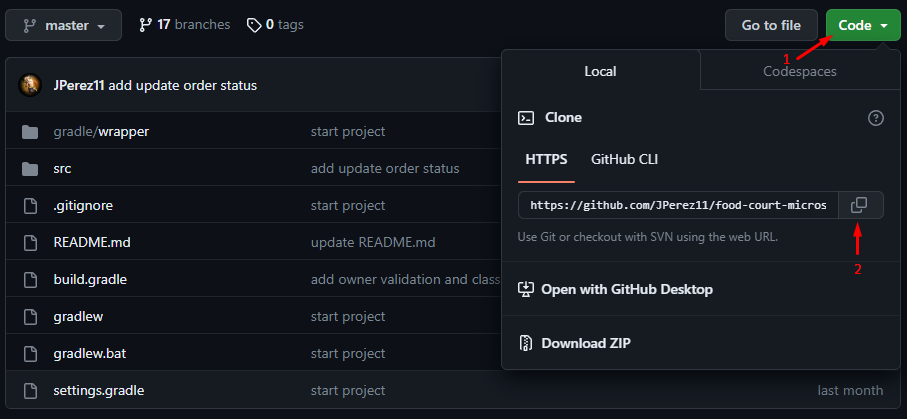
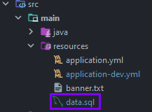
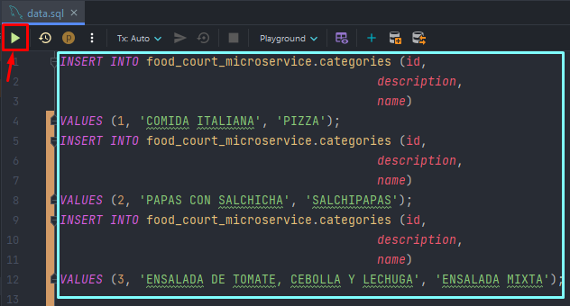
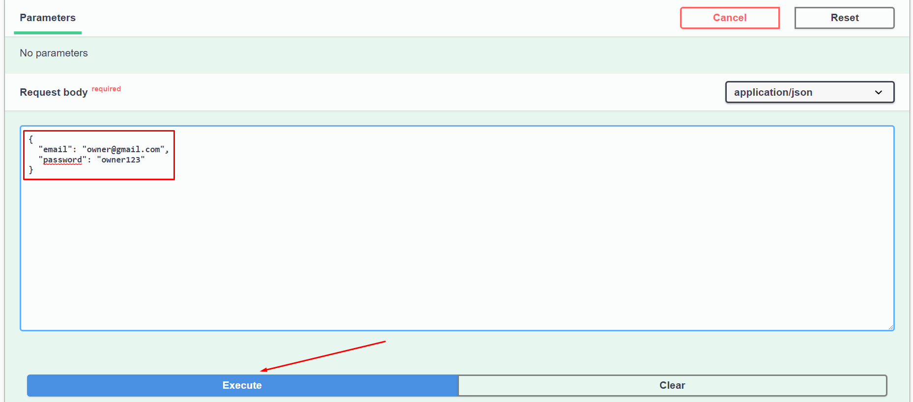
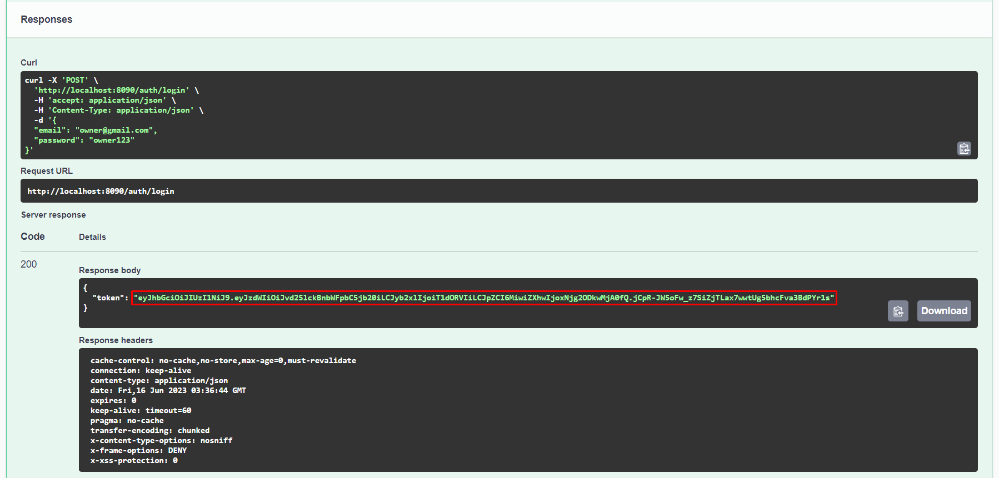
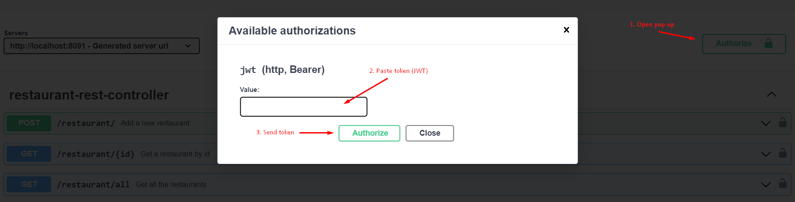

<br>
<div>
<h3 style="text-align: center">PRAGMA POWER-UP</h3>
  <p style="text-align: center">
    In this challenge, the backend of a system that centralizes the services and orders of a restaurant chain that has different branches in the city is designed. Specifically, this microservice focuses on the management of restaurants, dishes and orders.
  </p>
</div>

### Built With

* 
* 
* 
* 
* 
* 
* 


<!-- GETTING STARTED -->
## Getting Started

To get a local copy up and running follow these steps.

### Prerequisites

* JDK 17 [https://jdk.java.net/java-se-ri/17](https://jdk.java.net/java-se-ri/17)
* Gradle [https://gradle.org/install/](https://gradle.org/install/)
* MySQL [https://dev.mysql.com/downloads/installer/](https://dev.mysql.com/downloads/installer/)

### Recommended Tools
* IntelliJ Community [https://www.jetbrains.com/idea/download/](https://www.jetbrains.com/idea/download/)
* Postman [https://www.postman.com/downloads/](https://www.postman.com/downloads/)

### Installation

###### Recommendation: Watch the following video ######

<br>LINKS: 
<br> https://youtu.be/xIQZolmvbtM - Project explained
<br> https://youtu.be/PLQHsIf7g5g - Additional project settings

1. Clone the repository
   <br>
   <b>Steps:</b>
   <br>
   1. Press the green ``code`` button and press the copy button to copy the link
   <br><br>
   
   <br><br>
   2. Open a terminal like Git Bash and type the command ``git clone`` + the repository link copied earlier
   ```shell
   git clone https://github.com/JPerez11/food-court-microservice
   ```
   3. Change directory
   ```shell
   cd food-court-microservice
   ```
2. Create a new database in MySQL called food_court_microservice if the schema is not created with the statement: `createDatabaseIfNotExists=true` <b>OPTIONAL STEP</b>
3. Update the database connection settings (If necessary, change the localhost port if you have another port for MySQL)
   ```yml
   # src/main/resources/application-dev.yml
   spring:
      datasource:
          url: jdbc:mysql://localhost:3306/food_court_microservice?createDatabaseIfNotExist=true&allowPublicKeyRetrieval=true
          username: root
          password: <your-password>
          driver-class-name: com.mysql.cj.jdbc.Driver
   ```
4. Run the data.sql file to import the sample categories into the database
<br>
<b>Steps:</b>
<br>
   1. Find the "data.sql" file in the path: ``src/main/resources``
   <br><br>
   
   <br><br>
   2. Open the ``data.sql`` file, select the statements, and run the script
   <br><br>
   

5. After the tables are created, it is necessary to run the other microservice "user-microservice" to be able to consume the authentication token
   * Open Swagger UI in the following path: [http://localhost:8090/swagger-ui/index.html](http://localhost:8090/swagger-ui/index.html), then look for the /auth/login endpoint.
   
   * Enter a valid credentials for login, for example:
   
   * Copy the token that is generated when executing the request (omit quotation marks when copying)
   
   * The next step is to paste the token in the pop-up generated by the "Authorize" button of the Swagger of this microservice.
   
6. Then you can make use of the restaurant endpoints, you should be aware that some have restrictions on the role of the user who is logging in.

<!-- USAGE -->
## Usage

1. Right-click the class FoodCourtMicroserviceApplication and choose Run
2. Open [http://localhost:8091/swagger-ui/index.html](http://localhost:8091/swagger-ui/index.html) in your web browser

<!-- ROADMAP -->
## Tests

- Right-click the test folder and choose Run tests with coverage
